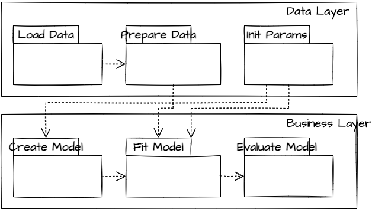

=======================
Project Management Plan
=======================

.. contents:: Table of Contents

Identification
--------------

Document Overview
~~~~~~~~~~~~~~~~~

This document outlines the manner in which the project will be planned 
and executed. It describes the project's development process. It 
contains additional information on development tools used.

Abbreviations and Glossary
~~~~~~~~~~~~~~~~~~~~~~~~~~

HMSC
  Hierarchical Modelling of Species Communities software name.
CSC
  Finnish IT Center for Science primary stakeholder.
    
References
~~~~~~~~~~

+--------------+------------------------------+-------------------------------------+
| **Document** | **Document Title**           | **URL**                             |
| **ID**       |                              |                                     |
+==============+==============================+=====================================+
| [hmsc]       | Ovaskainen, O. et al. 2017.  | https://doi.org/10.1111/ele.12757   |
|              | How to make more out of      |                                     |
|              | community data? A conceptual |                                     |
|              | framework and its            |                                     |
|              | implementation as models     |                                     |
|              | and software. Ecology        |                                     |
|              | Letters 20, 561-576.         |                                     |
+--------------+------------------------------+-------------------------------------+
| [pep8]       | PEP 8 – Style Guide for      | https://peps.python.org/pep-0008/   |
|              | Python Code                  |                                     |
+--------------+------------------------------+-------------------------------------+
| [tpope]      | A Note About Git             | http://tbaggery.com/2008/04/19/a-   |
|              | Commit Messages              | note-about-git-commit-messages.html |
+--------------+------------------------------+-------------------------------------+
| [cct]        | Cookiecutter: Better Project | https://cookiecutter.readthedocs.io |
|              | Templates                    | /en/stable/                         |
+--------------+------------------------------+-------------------------------------+
| [nbdiff]     | Welcome to NBDiff's          | https://nbdiff-docs.readthedocs.io/ |
|              | Documentation!               | en/latest/index.html                |
+--------------+------------------------------+-------------------------------------+

Project Management
~~~~~~~~~~~~~~~~~~

.. This section provides the organizational structure of HMSC and the
.. responsibilities assigned to the various members of the team.

Team and Responsibilities
-------------------------

.. Describe the team, possibly with a diagram of its organization.

Two members make up the HMSC team. We mutually share most analysis,
development, and testing tasks. Their responsibilities are listed 
in detail below.

In addition to the project team, we have a project supervisor, Dr
Otso Ovaskainen. He is the one of the PI of project funded by the 
HORIZON-INFRA-2021-TECH-01 titled, "Biodiversity Digital Twin for 
Advanced Modelling, Simulation and Prediction Capabilities."

+----------------+------------+-----------------------+
| **Title**      | **Name**   | **Responsibilities**  | 
+================+============+=======================+
| Team Member    | Gleb       | Software Development, |
|                | Tikhonov   | Documentation,        |
|                |            | Testing               |
+----------------+------------+-----------------------+
| Team Member    | Anis U     | Software Development, |
|                | Rahman     | Documentation,        |
|                |            | Testing               |
+----------------+------------+-----------------------+
   
Work Breakdown Structure, Tasks and Planning
--------------------------------------------

.. Through a table or otherwise, describe the tasks involved in the
.. development of your project. Through a diagram, describe your activity
.. planning.

Work Breakdown Structure and Task Estimation
~~~~~~~~~~~~~~~~~~~~~~~~~~~~~~~~~~~~~~~~~~~~

.. list-table:: WBS
  :header-rows:1

  * - **\#**
    -  **Work**
    -  **Estimated effort (hrs)**
  * - **1.**
    -  **PROJECT MANAGEMENT PLAN**
    -  65
  * - 1.1.
    -  Software Requirements Specification
    -  25
  * - 1.2.
    -  Data Gathering
    -  30
  * - 1.2.1.
    -  Research existing joint species distribution modeling
    -  10
  * - 1.2.2.
    -  Research end-to-end machine learning
    -  10
  * - 1.2.3.
    -  Research high-performance computing for machine learning
    -  10
  * - 1.3.
    -  Interview End-users
    -  5
  * - 1.4.
    -  Research Similar Solutions/Attempts
    -  5
  * - **2.**
    -  **DESIGN**
    -  25
  * - 2.1.
    -  Software Architecture Design
    -  15
  * - 2.1.1.
    -  Design modules for data loading/preparation/segregation
    -  5
  * - 2.1.2.
    -  Design modules for model structure and fit
    -  5
  * - 2.1.3.
    -  Design modeles for model evaluation
    -  5
  * - 2.2.
    -  Program Interface Design
    -  10
  * - 2.2.1.
    -  Create program configuration design
    -  5
  * - 2.2.2.
    -  Design program's command line interface (CLI)
    -  5
  * - **3.**
    -  **PROTOTYPE**
    -  20
  * - 3.1.
    -  Design prototype version of algorithm
    -  5
  * - 3.2.
    -  Design CLI for prototype
    -  5
  * - 3.3.
    -  Design tests for prototype
    -  5
  * - 3.4.
    -  Implement prototype version
    -  5
  * - **4.**
    -  **SOFTWARE DEVELOPMENT**
    -  
  * - 4.1.
    - Development
    -  220
  * - 4.1.1.
    -  Implement data loader
    -  20
  * - 4.1.2.
    -  Implement base model
    -  100
  * - 4.1.3.
    -  Implement model trainer
    -  100
  * - **5.**
    -  **TESTING AND QUALITY ASSURANCE**
    -  25
  * - 5.1.
    -  Test Plan
    -  5
  * - 5.2.
    -  Unit Testing
    -  15
  * - 5.2.1.
    -  Implement tests for loader
    -  5
  * - 5.2.2.
    -  Implement tests for trainer
    -  5
  * - 5.2.3.
    -  Implement tests for predictor
    -  5
  * - 5.3.
    -  Program CLI Testing
    -  5
  * - **6.**
    -  **INTEGRATION**
    -  
  * - 6.1.
    -  Integration Testing
    -  5
  * - **7.**
    -  **DEPLOYMENT/ROLLOUT**
    -  50
  * - 7.1.
    -  Define Configuration and Readme Files
    -  5
  * - 7.2.
    -  Define Online Help
    -  30
  * - 7.2.1.
    -  Documentation for hmsc.readthedocs.org
    -  20
  * - 7.3.
    -  Installation and User Guide
    -  5
  * - 7.3.1.
    -  Document installation instructions
    -  5
  * - 7.3.2.
    -  Document user guide
    -  5
  * - 7.4.
    -  Maintain and Update Documentation
    -  15
  * - **8.**
    - **PROJECT PLANNING**
    - 25
  * - 8.1.
    -  Team Meetings
    -  20
  * - 8.2.
    -  Stakeholder Meetings
    -  5
    
Relationships with project stakeholders
---------------------------------------

End-User Involvement
~~~~~~~~~~~~~~~~~~~~

.. Describe how end-users are involved in the development of the software:
.. meetings, reviews, feedback etc.

As our project will be an open source project, many end-users will
choose to give feedback on the GitHub issue tracker and mailing list,
before and after releases. 

Communication
-------------

Meetings
~~~~~~~~

.. What meetings you organize during development and what is expected to
.. happen during them.

-  Initial meeting: We will meet with our PI and discuss project
   requirements and goals.
-  Weekly meeting: We will discuss the project's progress bi-weekly with
   our team members in a remote meeting. We will discuss the features in 
   progress; our progress towards the next release/prototype, and review
   feedback from interested project repository watchers.
-  Post-release meeting: We will discuss a release of the software after
   it is published.

Reviews
~~~~~~~

.. Describe what kinds of reviews are organized during the project such as
.. design reviews, tests, code reviews etc. and what happens in these
.. reviews.
-  Code Review: Code review will be done on every pull request (i.e.,
   code change).

   -  At least one team member other than the author will review the 
   -  code change.
   -  The reviewer(s) will annotate the code with their comments.
   -  The developer will revise their pull request to satisfy the
      reviewer.
   -  The reviewer will merge the code change into the main repository.

-  Design Review: New features will be discussed in the GitHub issue
   tracker. Feedback will be solicited from interested watchers.
-  Release Candidates (RCs): before each release, a release candidate
   version will be provided to the supervisor and interested end-users
   for review. This will provoke feedback of various kinds.

Training
~~~~~~~~

.. Describe the training, if any, of the people involved in the project.

We started training before project initiation to learn both the pythonic
way of coding, end-to-end machine learning frameworks, and linear algebra
libraries. Before implementing a feature, we would have meetings to review
the topics that had been covered in the trainings and discuss available
choices for its implementation. We intend to continue this training 
throughout the project development phase to produce high quality code
and proficient software.

System Requirements and Project Input Data
------------------------------------------

Configuration Management
-----------------------------

Software Configuration Management
---------------------------------

.. What kind of configuration management tool is used, how and when the
.. database is saved etc

We will use Git for software configuration management. Each change to
the software will be captured in a commit on the developer's computer.
These changes will then be uploaded to GitHub for review and merging
into the master branch.

Each commit contains a description of the change. We will follow the
recommendations found on Tim Pope’s blog post on the
subject \ '[tpope] <http://tbaggery.com/2008/04/19/a-note-about-git-commit-messages.html>'__ and
enforce the rules during code review.

Documentation Configuration Management
--------------------------------------

.. Describe how you manage all documents produced, received and delivered
.. during the project.

We will use Git and GitHub
(https://github.com/tarmstrong/nbdiff-docs) to track our documents as we
produce and receive them. This will also track changes to the documents.

Software Development Management
-------------------------------

Software Development Process
----------------------------

Our development process will be based on an mixed development approach. 
The approach combines both the vertical and the horizontal approaches. 
The idea is to divide the project into features (vertical). Then each 
feature is divided into layers (horizontal) and attempted in an 
iterative and incremental manner. The rationale for this choice is:

-  to focus on important features in the project.
-  to continuous perform unit and integration tests, this makes the 
   outcomes predictable.
-  to regularly gather feedback to adjust requirements and design.

We have split the project into three major milestones spaced 5 weeks
apart. These will have equal portions of work with a release 
comprising a functioning feature of the software and a release of 
updated documents to the supervisor.

+-----------------+----------------------+
| **Milestone**   | **Milestone Date**   |
+=================+======================+
| M1              | 2012-09-19           |
+-----------------+----------------------+
| M2              | 2012-10-24           |
+-----------------+----------------------+
| M3              | 2012-11-28           |
+-----------------+----------------------+

Software Development Tools
--------------------------

The following is a list of the main tools we will use while developing
this project. We will add tools to this document as we discover which
are effective for our process.

-  Git: Git is a distributed version control system for source code.
-  GitHub: is a hosting service for Git that provides a web-based
   interface to various Git features, and includes issue trackers and
   release hosting.
-  Python: is the programming language compatible with the TensorFlow
   framework, we will adopt it to program our software.

   -  PyTests: is a unit testing tool for Python.
   -  PyFlakes: is a tool for automatically checking our Python code
      against the PEP-8 standard [pep8].
   -  Mock: is a library for mocking objects in unit tests for Python.
   -  Black: is an uncompromising Python code formatter.

-  TensorFlow: is a free and open-source software library for 
   machine learning and artificial intelligence. 
-  tf.linalg: is a TensorFlow library with operations for linear algebra.
-  Scipy: is a free and open-source Python library used for scientific 
   computing and technical computing.
-  Documentation:

   -  Sphinx: is a widely-used documentation system for Python. This
      will be useful for source code documentation and the manually 
      written documentation (including installation instructions, 
      tutorials, etc.)

-  TravisCI (https://travis-ci.org/): is a free, online continuous
   integration service that runs automated tests, checks code coverage,
   and checks code quality every time a patch is submitted to a project.
   This will be used to provide automatic verification of pull requests
   to aid reviewers.

Software Development Rules and Standards
----------------------------------------

For our source code (both functional code and test code), we will adhere
to the following standards. Where possible, we will use a tool to
automatically verify that our code adheres to the standard. We will also
verify this through our code reviews.

-  Coding standard for Python: PEP-8 [pep8] automated using Black
-  Static code analysis using PyFlakes: https://pypi.python.org/pypi/pyflakes

For architectural documentation, we will use the Unified Modeling
Language (UML).

Project architecture
--------------------

.. _orgchart:

The software domain involves a series of functional components including
data loading/preparation and modelling. The following use cases can be 
identified in general, namely

-  Collect/load/prepare data
-  View/use fitted model
-  Fit/Evaluate a model

The resulting use case diagram for the systems is,

We present a two-layered view of the system: data and bussiness layer. 
The layered view can be deployed on a single machine with a graphics 
co-processor. The data is available locally on the machine with the 
program invoked using a command-line interface. The data layer prepares
the program and loads the data, followed by fitting and evaluating a 
model.

The high-level logical view of the system captures the functionality 
provided to its end-users, and it illustrates the collaborations among 
the system components.
 

The high-level deployment view of the software demonstrates that the 
python source code is compatible for transformation into datagraphs 
for execution on co-processors located remotely in the form of 
high-performance computing platform.

Mapping existing R codebase
---------------------------

For reference the existing codebase in R has two main functions: 
sample_mcmc() and compute_predicted_values(). Below is the callgraph 
for sample_mcmc().

Likewise, the callgraph for compute_predicted_values() (renamed as 
compute_pred_vals()) is illustrated below. We plan to map these 
functions into the suitable component within the logical view 
presented earlier.

Folder structure
----------------

The directory structure of your new project looks like this: 

.. code-block::
  
  ├── LICENSE
  ├── Makefile           <- Makefile with commands like `make data` or `make train`
  ├── README.md          <- The top-level README for developers using this project.
  ├── data
  │   ├── external       <- Data from third party sources.
  │   ├── interim        <- Intermediate data that has been transformed.
  │   ├── processed      <- The final, canonical data sets for modeling.
  │   └── raw            <- The original, immutable data dump.
  │
  ├── docs               <- A default Sphinx project; see sphinx-doc.org for details
  │
  ├── models             <- Trained and serialized models, model predictions, or model summaries
  │
  ├── notebooks          <- Jupyter notebooks. Naming convention is a number (for ordering),
  │                         the creator's initials, and a short `-` delimited description, e.g.
  │                         `1.0-jqp-initial-data-exploration`.
  │
  ├── references         <- Data dictionaries, manuals, and all other explanatory materials.
  │
  ├── reports            <- Generated analysis as HTML, PDF, LaTeX, etc.
  │   └── figures        <- Generated graphics and figures to be used in reporting
  │
  ├── requirements.txt   <- The requirements file for reproducing the analysis environment, e.g.
  │                         generated with `pip freeze > requirements.txt`
  │
  ├── setup.py           <- Make this project pip installable with `pip install -e`
  ├── src                <- Source code for use in this project.
  │   ├── __init__.py    <- Makes src a Python module
  │   │
  │   ├── data           <- Scripts to download or generate data
  │   │   └── make_dataset.py
  │   │
  │   ├── features       <- Scripts to turn raw data into features for modeling
  │   │   └── build_features.py
  │   │
  │   ├── models         <- Scripts to train models and then use trained models to make
  │   │   │                 predictions
  │   │   ├── predict_model.py
  │   │   └── train_model.py
  │   │
  │   └── visualization  <- Scripts to create exploratory and results oriented visualizations
  │       └── visualize.py
  │
  └── tox.ini            <- tox file with settings for running tox; see tox.readthedocs.io

Test Phases Management
----------------------

Unit tests
~~~~~~~~~~

PyTest is a framework to improve testing productivity. The test are 
written in Python language, they are easy and scalable.

Feature Tests
~~~~~~~~~~~~~

One or multiple unit tests can be used to test the functionality of 
a component.

Integration Tests
~~~~~~~~~~~~~~~~~

To test multiple components of the software or to perform end-to-end 
testing to ensure that the software is working.

Performance Tests
~~~~~~~~~~~~~~~~~

We will perform performance tests to measure the efficiency of a 
piece of code. The size of the code may range from a single method 
to the whole software.

Problem Resolution
------------------

We will use GitHub’s issue tracking to handle all feature requests,
change requests, inquiries, questions as well as to report bugs.
Using GitHub’s tracking feature, issues will be opened when a matter is
raised. GitHub allows us to create custom categories to easily classify
our issues. This will allow us to filter through the different requests,
inquiries and/or bugs. We will also be able to assign issues to
different individuals based on who is more qualified to handle the given
issue. Comments can be left on issues, allowing for discussion and
problem solving among other team members, as well as status updates on
the given issue. Finally, once an issue is resolved, the issue can be
closed, allowing us to easily track which issues remain.